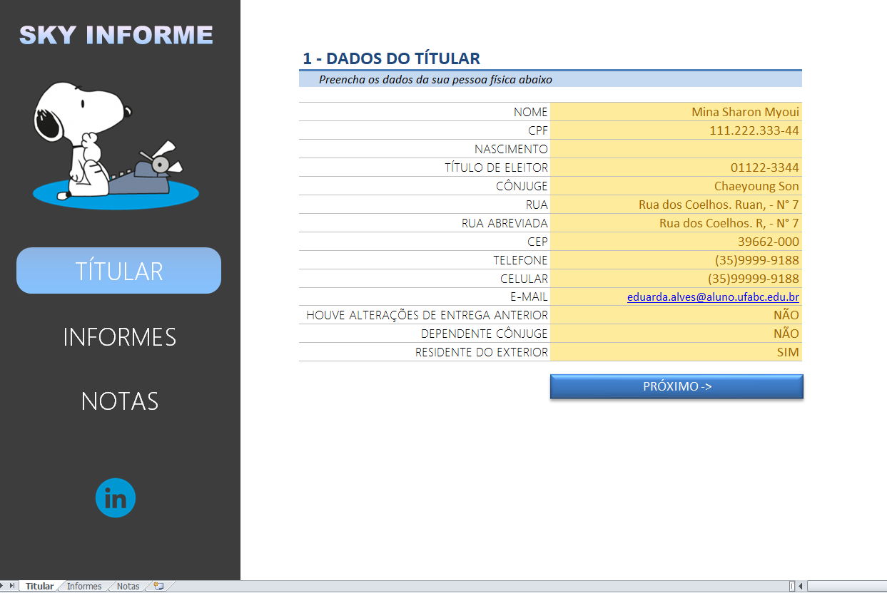
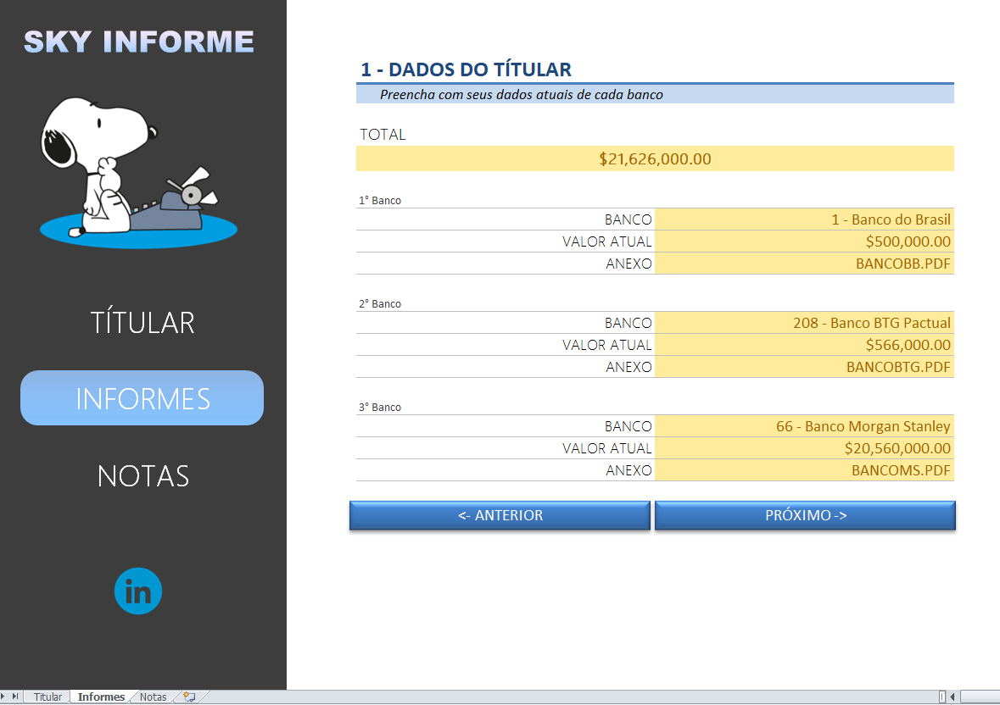
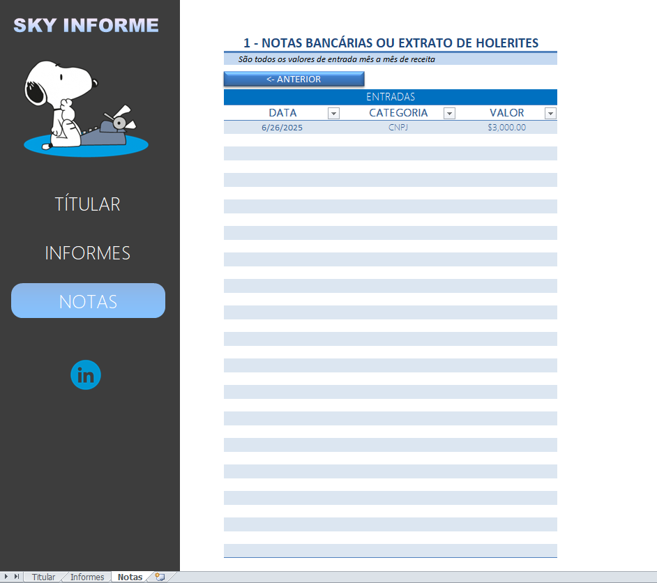

# Sky Informe – Planilha de Apoio à Declaração de Imposto de Renda  
Planilha desenvolvida no Excel como parte do bootcamp Excel com IA.

## Funcionalidades:
- Navegação por botões entre seções (Titular, Informes e Notas)  
- Validação automática de dados (formatos, campos obrigatórios)   
- Interface visual personalizada com tema leve  
- Células protegidas para evitar alterações acidentais  

## VBA
A planilha utiliza a função `MoverIconeParaPosicao()`, em VBA, para reposicionar ícones de forma automatizada.  
**Observação:** o código foi fornecido pelo professor e adaptado no projeto.

## Como usar:
1. Abra o arquivo `Sky_Informe.xlsx` no Excel  
2. Habilite as macros, se solicitado  
3. Use os botões laterais para navegar entre as seções  
4. Preencha os campos conforme solicitado  
5. Adicione links ou caminhos de arquivos nos campos de anexo  
6. Utilize livremente e personalize conforme necessário

## Visual

### Aba "Titular"

### Aba "Informes"

### Aba "Notas"

### Código VBA aplicado  

### Proteção da planilha  

## Arquivo  
`Sky_Informe.xlsx`: planilha principal

**Desenvolvido por Maria Eduarda Coutinho**

