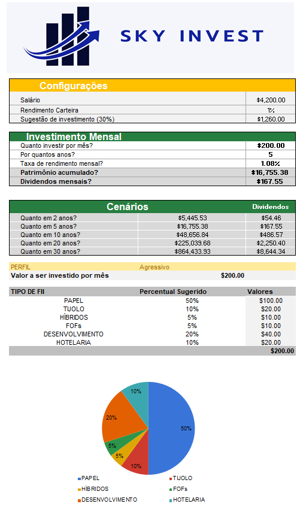

# Sky Invest – Planilha de Controle de Investimentos

Planilha desenvolvida no Excel como parte do curso **Excel com IA**.

## Funcionalidades:
- Sugestão automática de valor a investir com base em 30% do salário
- Projeção de patrimônio acumulado com a fórmula VF (Valor Futuro)
- Simulação de dividendos mensais, multiplicando rentabilidade por patrimônio
- Cenários de evolução patrimonial (em 2, 5, 10, 20 e 30 anos)
- Lista suspensa para perfil de investidor (ex: conservador, moderado, agressivo)
- Distribuição percentual por tipo de FII (Papel, Tijolo, FOFs etc.)
- Cálculo automático de valores por tipo de FII (usando percentual e PROCV)
- Uso da função PROCV para buscar dados da distribuição
- Gráfico de pizza para visualização da alocação
- Design limpo e visual, com uso de cores, seções organizadas e banner personalizado

## Visual

## Arquivo

- `Controle de Investimentos.xlsx`: planilha principal

---

Desenvolvido por Maria Eduarda Coutinho Alves
