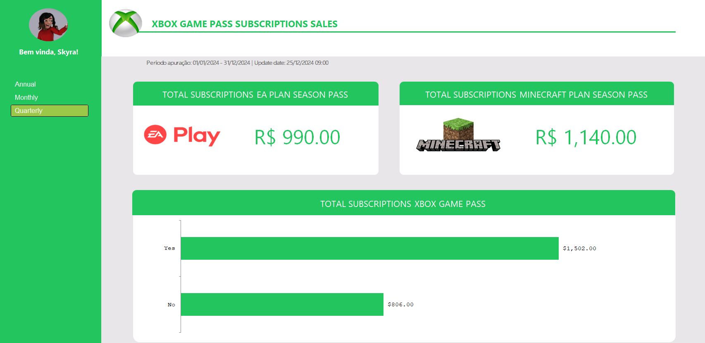

# Dashboard de Vendas – Xbox

Este projeto consiste na criação de um dashboard interativo em Excel com foco na visualização e análise de dados de vendas relacionados ao Xbox. O objetivo principal foi transformar dados brutos em informações visuais úteis, facilitando a leitura e permitindo uma análise rápida do desempenho.

## Objetivo

Desenvolver um painel dinâmico e visualmente organizado que permita:

- Observar o comportamento das vendas ao longo do tempo
- Avaliar os principais produtos, regiões ou canais de venda
- Tomar decisões com base em dados claros e organizados

## Ferramentas utilizadas

- Microsoft Excel
- Gráficos dinâmicos
- Tabelas dinâmicas

## Visual

## Estrutura do projeto

- `dashboard_xbox.xlsx` — Arquivo principal do Excel contendo o painel interativo
- `README.md` — Arquivo de descrição do projeto

## Como utilizar

1. Baixe o arquivo `dashboard_xbox.xlsx`
2. Abra com o Microsoft Excel
3. Use os filtros e segmentações para interagir com os dados
4. Explore os gráficos para entender padrões e desempenho de vendas

## Aprendizados

- Aplicação de recursos avançados do Excel
- Criação de dashboards limpos, funcionais e interativos
- Organização visual de informações para suporte à tomada de decisão

## Créditos

Projeto desenvolvido como parte de um projeto do bootcamp "Excel com IA".
